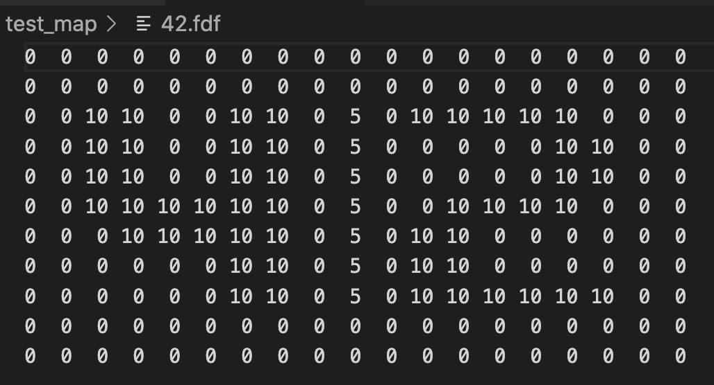
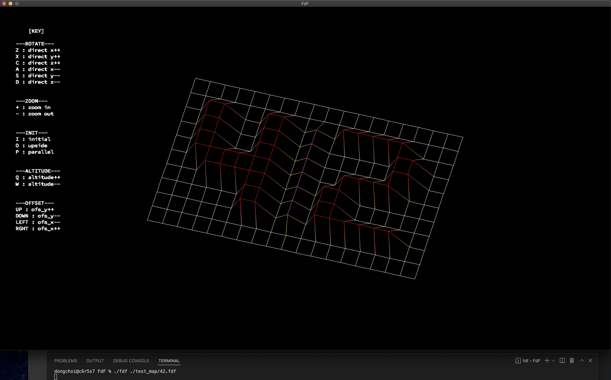

[학습 정리 노션 링크](https://www.notion.so/FdF-fils-de-fer-2022-7-11-da55a0373acf472ba980ef2be924b28b)

# FdF(fils de fer)
# 1. 무엇을 하는 과제인가?
- 42's graphic library 를 사용하기
- x,y,z의 값을 갖고있는 지도 파일을 읽고 isometic 도형으로 출력하기
- 보너스파트 : rotate, zoom, traslate 구현하기
- 허용함수 : malloc, free, write, read, open, close, perror, stderror, math.h, minilibX

 

# 2. 새롭게 배우는 개념은 무엇인가?
- 동적라이브러리 사용
- 주어진 라이브러리의 사용법을 이해하고 활용해보기
- 좌표를 갖고 선을 그릴 때 필요한 수학적 개념
    - 회전변환행렬(rotation matrix)
    - 선현보간법(linear interpolation)
    - 점과 점을 잇는 선 그리기 (DDA algorithm)

 

# 3. 과제하면서 습득한 것
- 라이브러리 사용법 습득 및 적용하는 방법
- 수학 공식의 코드화 및 프로그래밍에 적용
- 조건/경우에 따른 프로그래밍

 

# 4. 결과물
**map_file**

**excute**

 

# 5. 봉착된 문제 및 해결
## 점과 점을 잇는 선이 의도대로 그어지지 않음
- 어떨 때 선이 의도대로 그어지지 않는지 파악함
- DDA알고리즘에서 기울기가 1보다 클때와 작을 때로 구분하고, from_dot과 to_dot 중 작은 것에서부터 출발함
- 색을 찍어줄 pixel의 범위 지정 (0 < x의 최종 값 < WIDTH)
- color도 위에 맞춰서 찾아줌
 
## 키 입력시 에러 발생
- 주소 참조 오류 : 키 입력으로 좌표or env값이 바뀌었을 때, map_table의 x,y,z 값을 다 초기화하고 다시 세팅해줌
- 메모리 누수 : map_table을 다시 세팅할 때 문제가 있었음, read_list에서 split해줄 때 문제가 있었음 (디버깅 통해서 찾고 해결함)
