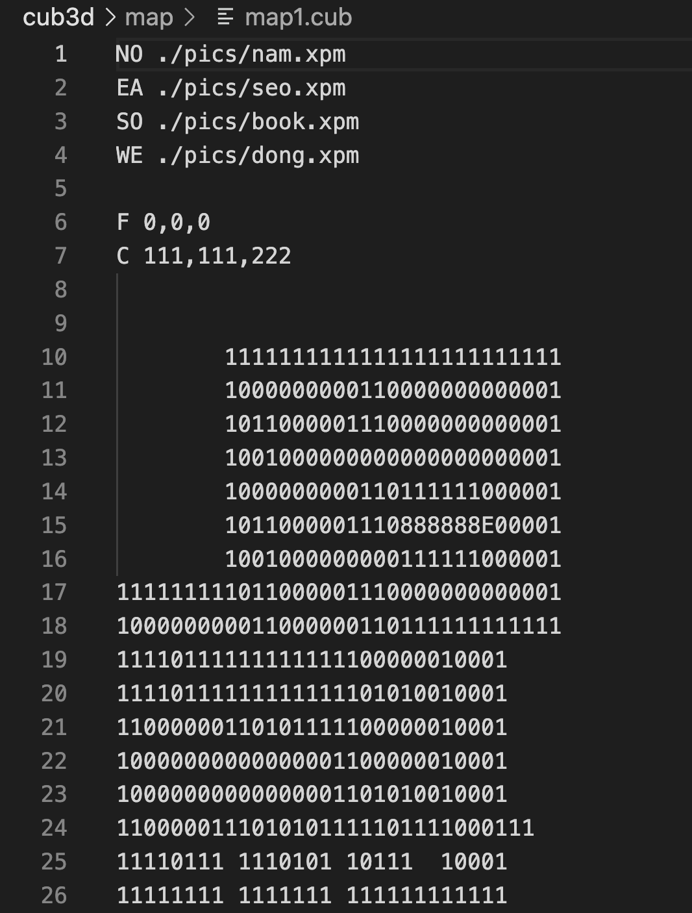
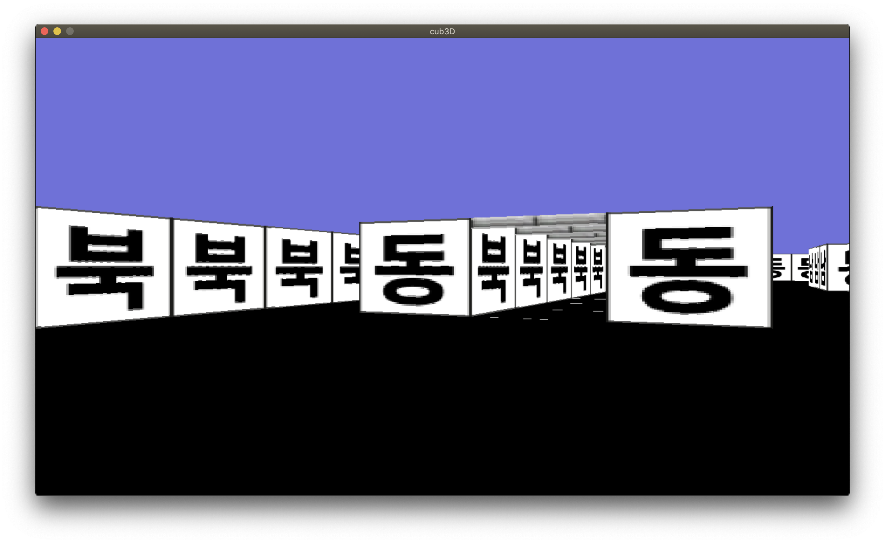

[노션 링크](https://helpful-eggplant-ec3.notion.site/cub3d-cb46069014fa417ea205f00d07bfd803)

# cub3D
# 과제 개요
## 1. 무엇을 하는 과제인가?
- 2D의 맵파일을 읽고 파싱하여 3D 게임 구현하기
- mlx graphic library를 사용하여 raycasting 하기

<br>

## 2. 새롭게 배운 개념
- raycasting
- 벡터

<br>

## 3. 팀프로젝트에서 기여한 파트
- 맵 파싱
- 벽 충돌 감지
- mouse, key 입력 받아서 처리하기
- ray casting (팀원과 협업)

<br>


## 4. 결과물
- 실행 방법  
```
$ make all
$ ./cub3D <map file>
```

**map**


**excute**



<br><br>

# 어려웠던 점 및 해결
## 그래픽 수학
- 그래픽 구현을 위해 계산하기 위해서는 벡터의 개념을 알아야 함. 벡터는 단어만 들어봤지 그 개념을 한번도 공부하지 않았었기에 그것부터 공부했음. 하지만 여전히 어려운 부분이고 잘 이해되지 않음.
- 백엔드/서버 분야에 관심이 있어서 그래픽과 관련된 수학 개념이 나에게 필요할지 몰라서 일단 패스하는데, 추후에 필요하면 더 학습해봐야겠음

## make에서 .h 파일 의존성
- 중간중간 테스트하면서 make 했을 때 변경사항이 잘 적용되지 않을 때가 있었음
- .h 파일은 makefile에서 의존성이 없었기에, make를 해도 바로 적용되지 않았음
- .h파일 변경한 후에, make re 를 통해 다시 빌드할 필요가 있음
 
## double 자료형
- 화면 출력을 위해 계산 할 때 소수를 사용함
- 평소 프로그래밍 할 때 int 자료형에 익숙해서, 습관적으로 int자료형에 값을 넣어 사용했었음. 그래서 잘못된 결과가 출력되곤 했음
- 습관적으로 자료형을 선정하기 말고, 차분히 생각하고 자료형을 선언할 것

