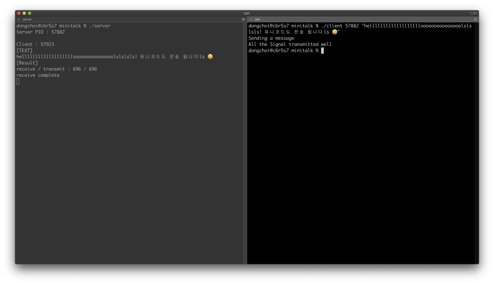

[노션 링크](https://helpful-eggplant-ec3.notion.site/minitalk-545bd8ee408447d78aa2956bcd6c997d)

# minitalk
# 1. 무엇을 하는 과제인가?
- UNIX signal (소켓통신)을 활용한 서버-클라이언트 메세지 보내기
- SIGUSR1, SIGUSR2 의 두가지 신호를 통해서 메세지 보내고 받는 프로그램 만들기
- 보너스파트 : 유니코드 지원, 서버에서 받은 signal개수 확인하는 작업 추가
- 허용함수 : write, signal, sigemptyset, sigaddset, sigaction, kill, getpid, malloc, free, pause, sleep, usleep, exit

 

# 2. 새롭게 배우는 개념은 무엇인가?
- UNIX signal을 통한 통신
- signal 관련 함수
- PID, 유니코드, UTF-8 인코딩 형식

 

# 3. 과제하면서 습득한 것
- UNIX signal을 통한 통신. 커널(시스템콜)을 통해 프로세스간 통신
- Process에 대한 개념
- signal을 다루는 함수들에 대한 이해
- UFT-8 형식에 대한 이해. write함수로 출력시해당 바이크 단위로 출력하지 않아도, 터미널이 UTF-8 형식이라면 알아서 바이트단위로 묶어서 출력해줌

 

# 4. 결과물

**excute**

 

# 5. 봉착된 문제 및 해결
## 문자를 쪼개서 신호로 보낼 때 제대로 가지 않음
- 문자를 % 2 연산을 통해서 보냈는데, char 형의 음수일 때 문제가 생김. unsigned char로 다뤄주거나 비트연산(>>)을 사용하면 해결 가능